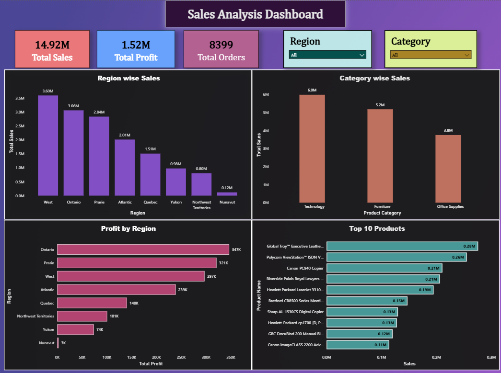

# 📊 Sales Data Analysis DASHBOARD - POWER BI

## 📌 Objective

Analyze sales performance across regions, categories, and products using Power BI.

---

## 🛠️ Tools Used

* Microsoft POWER BI

---

## Data Cleaning

* Corrected data type
* Removed duplicate items
* Verified data quality by checking missing values, errors, and value distributions

---

## KPIs
* Total Sales: 14.92M
* Total Profit: 1.52M
* Total Orders: 8399

---

## Visualizations
* Region-wise Sales
* Category-wise Sales
* Profit by Region
* Top 10 Products

---

## 📁 Files

* Sales_analysis_dashboard.pbix
* sales_data.csv
* screenshots/

---

## 📸 Dashboard Preview

---

## 📈 Key Insights

* West generated the highest sales revenue.
* Technology was the highest-performing product category.
* Ontario was among the top-performing regions.
* Several products generated negative profit and require further investigation.

---

## 🎯 Conclusion

This project demonstrates the use of POWER BI for data analysis, data aggregation, business insight generation, and reporting. The analysis helps identify sales performance trends, profitable categories, and loss-making products that can support data-driven business decisions.

